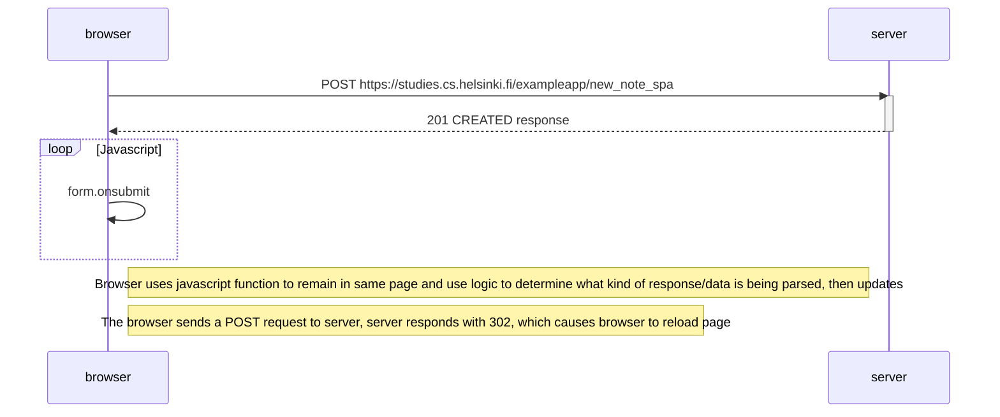

# 0.6

```mermaid
sequenceDiagram
browser->>server: POST https://studies.cs.helsinki.fi/exampleapp/new_note_spa
activate server
server-->>browser: 201 CREATED response
deactivate server

loop Javascript
  browser->>browser: form.onsubmit
end

Note right of browser: Browser uses javascript function to remain in same page and use logic to determine what kind of response/data is being parsed, then updates

Note right of browser: The browser sends a POST request to server, server responds with 302, which causes browser to reload page

```
